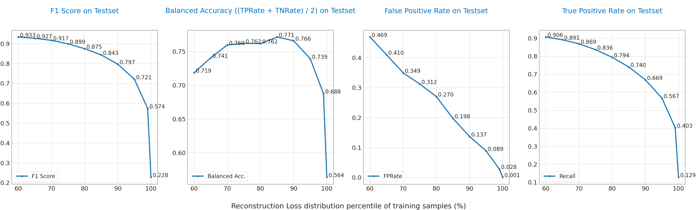

# ECG-Anomaly-Detection
ECG Anomaly Detection at the Edge using MAX78000
## Setup environment
1. install **pyenv**
   ```
   https://github.com/pyenv/pyenv#set-up-your-shell-environment-for-pyenv
   ```
2. Creating the Virtual Environment
   ```
   $ cd <your/project>
   $ git clone --recursive https://github.com/analogdevicesinc/ai8x-training.git
   $ cd ai8x-training
   $ pyenv local 3.11.8
   $ python -m venv .venv --prompt ai8x-training
   $ echo "*" > .venv/.gitignore
   $ source .venv/bin/activate
   (ai8x-training) $ pip3 install -U pip wheel setuptools
   (ai8x-training) $ pip3 install -r requirements.txt --extra-index-url https://download.pytorch.org/whl/cu121
   (ai8x-training) $ pip3 install -r requirements.txt --extra-index-url https://download.pytorch.org/whl/rocm5.7
   (ai8x-training) $ deactivate
   $ cd <your/project>
   $ git clone --recursive https://github.com/analogdevicesinc/ai8x-synthesis.git
   $ cd ai8x-synthesis
   $ pyenv local 3.11.8
   $ python -m venv .venv --prompt ai8x-synthesis
   $ echo "*" > .venv/.gitignore
   $ source .venv/bin/activate
   (ai8x-synthesis) $ pip3 install -U pip setuptools
   (ai8x-synthesis) $ pip3 install -r requirements.txt
   ```
3. Embedded Software Development Kit (MSDK)

   **Prerequisites**
   ```
   $ sudo apt update && sudo apt install libxcb-glx0 libxcb-icccm4 libxcb-image0 libxcb-shm0 libxcb-util1 libxcb-keysyms1 libxcb-randr0 libxcb-render-util0 libxcb-render0 libxcb-shape0 libxcb-sync1 libxcb-xfixes0 libxcb-xinerama0 libxcb xkb1 libxcb1 libxkbcommon-x11-0 libxkbcommon0 libgl1 libusb-0.1-4 libhidapi-libusb0 libhidapi-hidraw0
   ```

   **Download MSDK installer**

   <https://www.analog.com/en/resources/evaluation-hardware-and-software/embedded-development-software/software-download.html?swpart=SFW0018720B>

   **Final Check**

   After a successful manual or MSDK installation, the following commands will run from on the terminal and display their version numbers:
   ```
   arm-none-eabi-gcc -v
   arm-none-eabi-gdb -v
   make -v
   openocd -v
   ```
   gen-demos-max78000.sh and gen-demos-max78002.sh will create code that is compatible with the MSDK and copy it into the MSDK’s Example directories.

## Overview

In this project, I will explore the fascinating field of electrocardiogram (ECG) signal processing and classification, leveraging the power of a Convolutional Neural Network (CNN) Autoencoder. My selected dataset for this endeavor is the PTB Diagnostic ECG Database, a carefully curated collection of ECG signals designed specifically for diagnostic purposes. My main goal is to build a tiny Autoencoder model tailored to the task of detecting abnormal electrocardiogram (ECG) signals at the Edge using MAX78000. 

The following sections will present the abnormal detection system for the edge devices. The designed model is trained, deployed, and verified on MAX78000 EVkit.

## Dataset Information
The PTB Diagnostic ECG Database is a collection of 14,552 ECG recordings sourced from Physionet's PTB Diagnostic Database. These ECG signals are categorized into two classes: normal heartbeats and those affected by cardiac abnormalities. The dataset is sampled at 125Hz, providing high-resolution data for in-depth analysis.

Let's delve into some essential details about the PTB Diagnostic ECG Database:

* Number of Samples: 14,552
* Number of Categories: 2
* Sampling Frequency: 125Hz
* 
Remark: All the samples are cropped, downsampled and padded with zeroes if necessary to the fixed dimension of 188.

Data Source: [Physionet's PTB Diagnostic Database](https://www.kaggle.com/datasets/shayanfazeli/heartbeat)

Data Files: This dataset consists of a series of CSV files. Each of these CSV files contain a matrix, with each row representing an example in that portion of the dataset. **The final element of each row denotes the class to which that example belongs**.

## Data Loader Design
The data loader handles all the data related tasks for proper model training such as raw data pre-processing, windowing, type casting etc.
The data loader implementation is in the training repository, ([datasets/sampleecg.py](ai8x-training/datasets/sampleecg.py)). Its functionality is described in the following sections.
### Train – Test Set Distributions
The data loader also handles the train-test data splitting operations. In an unsupervised learning approach, the training set only includes normal samples without any arrhythmia. 20% of the normal data is also kept for the validation set and contributes to the testset as well. The testset includes all kinds of arrhythmia heartbeat.

### Label Modes
For autoencoder model training, the data samples will have a label equivalent to the input signal since an MSE loss will be used and the aim of the model is to reconstruct the input as closely as possible. For the evaluation mode where anomaly detection performance is of interest, each data sample will have a binary label representing whether the raw data session is a normal case or includes any arrhythmia.

## Model Structure and Training
### Model Structure
The neural network architecture is called an autoencoder. Autoencoders learn to reconstruct their input at their output. The autoencoder is trained so that the maximum information is kept after dimension reduction through encoding and has the minimum reconstruction loss (RL) after decoding. Therefore, the encoder and decoder structures are forced to learn the best encoding-decoding scheme in the training process. Autoencoders are well suited to an unsupervised learning approach using the normal signal reconstruction and provide a high RL when a arrhythmia case is encountered that deviates from normal data.

The model implementation file is in the training repository, ([models/ai85net-autoencoder-ecg.py](ai8x-training/models/ai85net-autoencoder-ecg.py)).

The input to the autoencoder is a 2D tensor of shape (187, 1). There are 187 channels each of width 1. CNN filters work depthwise across channels, so at the input layer, each filter is looking at a single axis at a time. The output data format is a 1D tensor of length 187 (1 axes × 187 samples). The reason is that the output layer is a fully connected layer, not a convolutional layer.

The use of a fully connected layer for the output layer (and several internal hidden layers) is to accommodate the fact that 1D transpose convolutions are not yet available in the target software stack. Transpose convolutions are generally used in the decoder to reconstruct the compressed representation of the data that the decoder received. Convolutional layers are used in the encoder to reduce the number of total parameters in the model.

The model training script is also available in the training repository, ([scripts/train_autoencoder_ecg.sh](ai8x-training/scripts/train_autoencoder_ecg.sh)).

### Finish the training process:
```
==> Best [Top 1 (MSE): 0.01245   Params: 55456 on epoch: 368]
Saving checkpoint to: logs/2024.11.04-144418/qat_checkpoint.pth.tar
--- test ---------------------
810 samples (32 per mini-batch)
Test: [    1/   26]    Loss 0.012738    MSE 0.012738    
Test: [    2/   26]    Loss 0.013812    MSE 0.013812    
Test: [    3/   26]    Loss 0.013366    MSE 0.013366    
Test: [    4/   26]    Loss 0.014103    MSE 0.014103    
Test: [    5/   26]    Loss 0.013647    MSE 0.013647    
Test: [    6/   26]    Loss 0.013966    MSE 0.013966    
Test: [    7/   26]    Loss 0.013821    MSE 0.013821    
Test: [    8/   26]    Loss 0.013421    MSE 0.013421    
Test: [    9/   26]    Loss 0.013230    MSE 0.013230    
Test: [   10/   26]    Loss 0.013219    MSE 0.013219    
Test: [   11/   26]    Loss 0.013406    MSE 0.013406    
Test: [   12/   26]    Loss 0.013289    MSE 0.013289    
Test: [   13/   26]    Loss 0.013554    MSE 0.013554    
Test: [   14/   26]    Loss 0.013605    MSE 0.013605    
Test: [   15/   26]    Loss 0.013698    MSE 0.013698    
Test: [   16/   26]    Loss 0.013600    MSE 0.013600    
Test: [   17/   26]    Loss 0.013713    MSE 0.013713    
Test: [   18/   26]    Loss 0.013680    MSE 0.013680    
Test: [   19/   26]    Loss 0.013739    MSE 0.013739    
Test: [   20/   26]    Loss 0.013638    MSE 0.013638    
Test: [   21/   26]    Loss 0.013691    MSE 0.013691    
Test: [   22/   26]    Loss 0.013681    MSE 0.013681    
Test: [   23/   26]    Loss 0.013818    MSE 0.013818    
Test: [   24/   26]    Loss 0.013912    MSE 0.013912    
Test: [   25/   26]    Loss 0.013826    MSE 0.013826    
Test: [   26/   26]    Loss 0.013875    MSE 0.013841    
==> MSE: 0.01384    Loss: 0.014


Log file for this run: ai8x-training/logs/2024.11.04-144418/2024.11.04-144418.log

```
### Post-Training Quantization
copy _ai8x-training/logs/2024.11.04-144418/qat_checkpoint.pth.tar_ to _ai8x-synthesis/trained/ai85-autoencoder-ecg-qat.pth.tar_

The model quantize script is also available in the synthesis repository [scripts/quantize_autoencoder_ecg_max78000.sh](ai8x-synthesis/scripts/quantize_autoencoder_ecg_max78000.sh)


## Trained Model Evaluation Notebook
The trained autoencoder model will generate an output with the input signal shape, and is trained to reconstruct the normal signal as closely as possible. A small post-processing step is required to deploy the model in the arrhythmia detection system: The system should mark some inputs as anomalies using the model output.

The basic principle of this post-processing step is to use the reconstruction loss (RL) level to detect any arrhythmia. Therefore, a pre-determined, learned threshold is needed for the decision boundary. Using training samples' RL percentiles is practical and a sample evaluation script is also available in training repository, ([notebooks/ECG_AutoEncoder_Evaluation.ipynb](ai8x-training/notebooks/ECG_AutoEncoder_Evaluation.ipynb)) and demonstrates these post-processing and performance evaluation steps.

Several performance metrics such as balanced accuracy (average of True Positive Rate and True Negative Rate) and False Positive Rate, F1 score, etc. are evaluated in this notebook. Some evaluation plots for the Physionet's PTB Diagnostic Database are:




