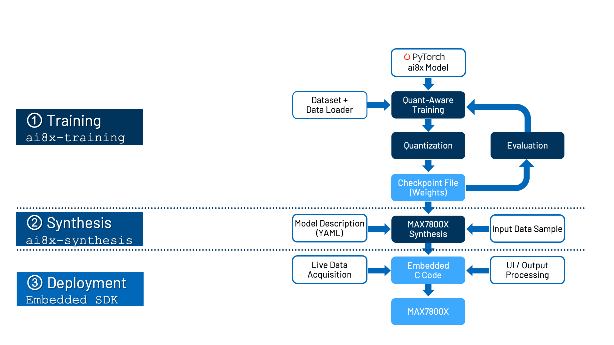

# ECG-Anomaly-Detection
ECG Anomaly Detection at the Edge using MAX78000
## Setup environment
1. install **pyenv**
   ```
   https://github.com/pyenv/pyenv#set-up-your-shell-environment-for-pyenv
   ```
2. Creating the Virtual Environment
   ```
   $ cd <your/project>
   $ git clone --recursive https://github.com/analogdevicesinc/ai8x-training.git
   $ cd ai8x-training
   $ pyenv local 3.11.8
   $ python -m venv .venv --prompt ai8x-training
   $ echo "*" > .venv/.gitignore
   $ source .venv/bin/activate
   (ai8x-training) $ pip3 install -U pip wheel setuptools
   (ai8x-training) $ pip3 install -r requirements.txt --extra-index-url https://download.pytorch.org/whl/cu121
   (ai8x-training) $ pip3 install -r requirements.txt --extra-index-url https://download.pytorch.org/whl/rocm5.7
   (ai8x-training) $ deactivate
   $ cd <your/project>
   $ git clone --recursive https://github.com/analogdevicesinc/ai8x-synthesis.git
   $ cd ai8x-synthesis
   $ pyenv local 3.11.8
   $ python -m venv .venv --prompt ai8x-synthesis
   $ echo "*" > .venv/.gitignore
   $ source .venv/bin/activate
   (ai8x-synthesis) $ pip3 install -U pip setuptools
   (ai8x-synthesis) $ pip3 install -r requirements.txt
   ```
3. Embedded Software Development Kit (MSDK)

   **Prerequisites**
   ```
   $ sudo apt update && sudo apt install libxcb-glx0 libxcb-icccm4 libxcb-image0 libxcb-shm0 libxcb-util1 libxcb-keysyms1 libxcb-randr0 libxcb-render-util0 libxcb-render0 libxcb-shape0 libxcb-sync1 libxcb-xfixes0 libxcb-xinerama0 libxcb xkb1 libxcb1 libxkbcommon-x11-0 libxkbcommon0 libgl1 libusb-0.1-4 libhidapi-libusb0 libhidapi-hidraw0
   ```

   **Download MSDK installer**

   <https://www.analog.com/en/resources/evaluation-hardware-and-software/embedded-development-software/software-download.html?swpart=SFW0018720B>

   **Final Check**

   After a successful manual or MSDK installation, the following commands will run from on the terminal and display their version numbers:
   ```
   arm-none-eabi-gcc -v
   arm-none-eabi-gdb -v
   make -v
   openocd -v
   ```
   gen-demos-max78000.sh and gen-demos-max78002.sh will create code that is compatible with the MSDK and copy it into the MSDK’s Example directories.

## Overview
The following graphic shows an overview of the development flow:

